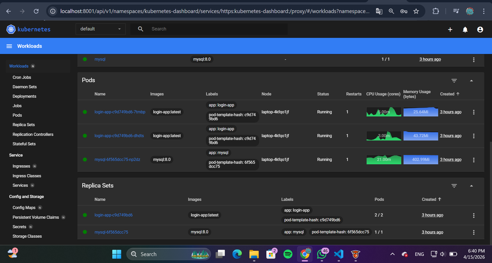

# Kubernetes Installation on Ubuntu 22.04/24.04

Get the detailed information about the installation from the below-mentioned websites of **Docker** and **Kubernetes**.

[Docker](https://docs.docker.com/)

[Kubernetes](https://kubernetes.io/)

### Set up the Docker and Kubernetes repositories:

### Requirements

1. Ubuntu machines as Master and Worker ( build on VM using Bridge Adapter) minimal 2 machines: 1 Master and 1 Worker
2. Networking uses local network (FILKOM)

> Download the GPG key for docker

```bash
wget -O - https://download.docker.com/linux/ubuntu/gpg > ./docker.key

gpg --no-default-keyring --keyring ./docker.gpg --import ./docker.key

gpg --no-default-keyring --keyring ./docker.gpg --export > ./docker-archive-keyring.gpg

sudo mv ./docker-archive-keyring.gpg /etc/apt/trusted.gpg.d/
```

**Output / Hasil:**

!

> Add the docker repository and install docker

```bash
# we can get the latest release versions from https://docs.docker.com

sudo add-apt-repository "deb [arch=amd64] https://download.docker.com/linux/ubuntu $(lsb_release -cs) stable" -y
sudo apt update -y
sudo apt install git wget curl socat -y
sudo apt install -y docker-ce

```

**Output / Hasil:**

!

**To install cri-dockerd for Docker support**

**Docker Engine does not implement the CRI which is a requirement for a container runtime to work with Kubernetes. For that reason, an additional service cri-dockerd has to be installed. cri-dockerd is a project based on the legacy built-in Docker Engine support that was removed from the kubelet in version 1.24.**

> Get the version details

```bash
VER=$(curl -s https://api.github.com/repos/Mirantis/cri-dockerd/releases/latest|grep tag_name | cut -d '"' -f 4|sed 's/v//g')
```

> Run below commands

```bash

wget https://github.com/Mirantis/cri-dockerd/releases/download/v${VER}/cri-dockerd-${VER}.amd64.tgz

tar xzvf cri-dockerd-${VER}.amd64.tgz

sudo mv cri-dockerd/cri-dockerd /usr/local/bin/

wget https://raw.githubusercontent.com/Mirantis/cri-dockerd/master/packaging/systemd/cri-docker.service

wget https://raw.githubusercontent.com/Mirantis/cri-dockerd/master/packaging/systemd/cri-docker.socket

sudo mv cri-docker.socket cri-docker.service /etc/systemd/system/

sudo sed -i -e 's,/usr/bin/cri-dockerd,/usr/local/bin/cri-dockerd,' /etc/systemd/system/cri-docker.service

sudo systemctl daemon-reload
sudo systemctl enable cri-docker.service
sudo systemctl enable --now cri-docker.socket

```

**Output / Hasil:**

!

> Add the GPG key for kubernetes

```bash
curl -fsSL https://pkgs.k8s.io/core:/stable:/v1.31/deb/Release.key | sudo gpg --dearmor -o /etc/apt/keyrings/kubernetes-apt-keyring.gpg
```

> Add the kubernetes repository

```bash
echo "deb [signed-by=/etc/apt/keyrings/kubernetes-apt-keyring.gpg] https://pkgs.k8s.io/core:/stable:/v1.31/deb/ /" | sudo tee /etc/apt/sources.list.d/kubernetes.list
```

> Update the repository

```bash
# Update the repositiries
sudo apt-get update
```

> Install Kubernetes packages.

```bash
# Use the same versions to avoid issues with the installation.
sudo apt-get install -y kubelet kubeadm kubectl
```

> To hold the versions so that the versions will not get accidently upgraded.

```bash
sudo apt-mark hold docker-ce kubelet kubeadm kubectl

```

> Enable the iptables bridge

```bash
cat <<EOF | sudo tee /etc/modules-load.d/k8s.conf
overlay
br_netfilter
EOF

sudo modprobe overlay
sudo modprobe br_netfilter

# sysctl params required by setup, params persist across reboots
cat <<EOF | sudo tee /etc/sysctl.d/k8s.conf
net.bridge.bridge-nf-call-iptables  = 1
net.bridge.bridge-nf-call-ip6tables = 1
net.ipv4.ip_forward                 = 1
EOF

# Apply sysctl params without reboot
sudo sysctl --system
```

**Output / Hasil:**

!

### Disable SWAP

> Disable swap on controlplane and dataplane nodes

```bash
sudo swapoff -a
```

```bash
sudo vim /etc/fstab
# comment the line which starts with **swap.img**.
```

**Output / Hasil:**

!

### On the Control Plane server (Master node)

> Initialize the cluster by passing the cidr value and the value will depend on the type of network CLI you choose.

**Calico**

```bash
# Calico network
# Make sure to copy the join command
sudo kubeadm init --apiserver-advertise-address=<control_plane_ip> --cri-socket unix:///var/run/cri-dockerd.sock  --pod-network-cidr=192.168.0.0/16

# Or Use below command if the node network is not 192.168.x.x
sudo kubeadm init --apiserver-advertise-address=<control_plane_ip> --cri-socket unix:///var/run/cri-dockerd.sock  --pod-network-cidr=10.244.0.0/16

# Copy your join command and keep it safe.
# Below is a sample format
# Add --cri-socket /var/run/cri-dockerd.sock to the command
kubeadm join <control_plane_ip>:6443 --token 31rvbl.znk703hbelja7qbx --cri-socket unix:///var/run/cri-dockerd.sock --discovery-token-ca-cert-hash sha256:3dd5f401d1c86be4axxxxxxxxxx61ce965f5xxxxxxxxxxf16cb29a89b96c97dd
```

**Output / Hasil:**

!

> To start using the cluster with current user.

```bash
mkdir -p $HOME/.kube
sudo cp -i /etc/kubernetes/admin.conf $HOME/.kube/config
sudo chown $(id -u):$(id -g) $HOME/.kube/config
```

**Output / Hasil:**

!

> To set up the Calico network

```bash
# Use this if you have initialised the cluster with Calico network add on.
kubectl create -f https://raw.githubusercontent.com/projectcalico/calico/v3.28.2/manifests/tigera-operator.yaml

curl https://raw.githubusercontent.com/projectcalico/calico/v3.28.2/manifests/custom-resources.yaml -O

# Change the ip to 10.244.0.0/16 if the node network is 192.168.x.x
kubectl create -f custom-resources.yaml

```

**Output / Hasil:**

!

!

> Check the nodes

```bash
# Check the status on the master node.
kubectl get nodes
```

**Output / Hasil:**

!

### On each of Data plane node (Worker node)

> Joining the node to the cluster:

> Don't forget to include _--cri-socket unix:///var/run/cri-dockerd.sock_ with the join command

```bash
sudo kubeadm join $controller_private_ip:6443 --token $token --discovery-token-ca-cert-hash $hash
#Ex:
# kubeadm join <control_plane_ip>:6443 --cri-socket unix:///var/run/cri-dockerd.sock --token 31rvbl.znk703hbelja7qbx --discovery-token-ca-cert-hash sha256:3dd5f401d1c86be4axxxxxxxxxx61ce965f5xxxxxxxxxxf16cb29a89b96c97dd
# sudo kubeadm join 10.34.7.115:6443 --cri-socket unix:///var/run/cri-dockerd.sock --token kwdszg.aze47y44h7j74x6t --discovery-token-ca-cert-hash sha256:3bd51b39b3a166a4ba5914fc3a19b61cfe81789965da6ac23435edb6aeed9e0d
```

**TIP**

> If the joining code is lost, it can retrieve using below command

```bash
kubeadm token create --print-join-command
```

### To install metrics server (Master node)

```bash
git clone https://github.com/mialeevs/kubernetes_installation_docker.git
cd kubernetes_installation_docker/
kubectl apply -f metrics-server.yaml
cd
rm -rf kubernetes_installation_docker/
```

### Installing Dashboard (Master node)

1. _Installing Helm:_
   Download and install Helm with the following commands:

```bash
     curl -fsSL -o get_helm.sh https://raw.githubusercontent.com/helm/helm/main/scripts/get-helm-3
     chmod +x get_helm.sh
     ./get_helm.sh
     helm
```

**Output / Hasil:**

!

3. _Adding the Kubernetes Dashboard Helm Repository:_
   Add the repository and verify it:

```bash
     helm repo add kubernetes-dashboard https://kubernetes.github.io/dashboard/
     helm repo list
```

5. _Installing Kubernetes Dashboard Using Helm:_
   Install it in the `kubernetes-dashboard` namespace:

```bash
     helm upgrade --install kubernetes-dashboard kubernetes-dashboard/kubernetes-dashboard --create-namespace --namespace kubernetes-dashboard
     kubectl get pods,svc -n kubernetes-dashboard
```

7. _Accessing the Dashboard:_
   Expose the dashboard using a NodePort:

```bash
     kubectl expose deployment kubernetes-dashboard-kong --name k8s-dash-svc --type NodePort --port 443 --target-port 8443 -n kubernetes-dashboard
```

run: kubectl get pods,svc -n kubernetes-dashboard
use this port to access the dashboard from phy node IP:
....
service/k8s-dash-svc NodePort 10.110.85.135 <none> 443:30346/TCP 23s

9. _Generating a Token for Login:_
   Create a service account and generate a token:

```bash
   nano k8s-dash.yaml
```

```bash
apiVersion: v1
kind: ServiceAccount
metadata:
  name: widhi
  namespace: kube-system
---
apiVersion: rbac.authorization.k8s.io/v1
kind: ClusterRoleBinding
metadata:
  name: widhi-admin
roleRef:
  apiGroup: rbac.authorization.k8s.io
  kind: ClusterRole
  name: cluster-admin
subjects:
- kind: ServiceAccount
  name: widhi
  namespace: kube-system
```

then run:

```bash
kubectl apply -f k8s-dash.yaml
```

10. Generate the token:  
     kubectl create token widhi -n kube-system

**Output / Hasil:**

!

---

---

# Deployment Guide for Login Web Application on Kubernetes

This guide provides step-by-step instructions for deploying the login web application with MySQL database on Kubernetes. All configuration files are already included in the repository.

## 1. Clean Up Previous Deployments

First, clean up any previous deployments related to this project:

```bash
# Delete deployments
kubectl delete deployment login-app mysql

# Delete services
kubectl delete service login-app mysql

# Delete PVCs and PVs
kubectl delete pvc mysql-pvc
kubectl delete pv mysql-pv

# Delete secrets
kubectl delete secret mysql-secret
```

**Output / Hasil:**

!

!

## 2. Build and Load Docker Image

```bash
 git clone https://github.com/Widhi-yahya/kubernetes_installation_docker.git
```

Navigate to the app directory and build the Docker image:

```bash
# Navigate to app directory
cd k8s-login-app/app

# Build Docker image
docker build -t login-app:latest .

# Save Docker image as TAR file for distribution to worker nodes
docker save login-app:latest > login-app.tar
```

**Output / Hasil:**

!

If your worker nodes don't share the Docker registry with your control plane, transfer and load the image on all nodes:

```bash
# Transfer the image to worker nodes (replace with actual node IPs)
scp login-app.tar user@worker-node:/home/user/

# On each worker node, load the image
docker load < login-app.tar
```

## 3. Prepare Storage for MySQL

Create a directory on your worker node to store MySQL data:

```bash
# Create a directory on your worker node for MySQL data (execute on worker node)
sudo mkdir -p /mnt/data
sudo chmod 777 /mnt/data
```

**Output / Hasil:**

!

## 4. Deploy MySQL Database

Apply the MySQL configurations:

```bash
# Apply MySQL configurations
kubectl apply -f k8s/mysql-secret.yaml
kubectl apply -f k8s/mysql-pv.yaml
kubectl apply -f k8s/mysql-pvc.yaml
kubectl apply -f k8s/mysql-service.yaml
kubectl apply -f k8s/mysql-deployment.yaml

# Check if MySQL pod is running
kubectl get pods -l app=mysql

# Wait for MySQL pod to be ready
kubectl wait --for=condition=ready pod -l app=mysql --timeout=180s
```

**Output / Hasil:**

!

## 5. Deploy Web Application

Deploy the web application after MySQL is running:

```bash
# Apply web application configurations
kubectl apply -f k8s/web-deployment.yaml
kubectl apply -f k8s/web-service.yaml

# Check if web application pods are running
kubectl get pods -l app=login-app
```

**Output / Hasil:**

!

## 6. Access the Application

The application is exposed through a NodePort service on port 30080. You can access it from either node:

```
http://10.34.7.115:30080  (Master node)
http://10.34.7.5:30080    (Worker node)
```

Both URLs work from any machine on your local network (10.34.7.0/24).

## 7. Testing the Application

1. Open your web browser and navigate to `http://10.34.7.115:30080`
2. Register a new user or use the default credentials:
   - Username: `admin`
   - Password: `admin123`
3. After login, you'll be redirected to the dashboard where you can upload images

**Output / Hasil:**

!

## 8. Important: Calico Networking Configuration

The cluster uses Calico CNI with VXLAN. If you experience networking issues between nodes, ensure Calico is configured to detect the correct network interface:

```bash
# Fix Calico IP detection to use the correct interface
kubectl set env daemonset/calico-node -n calico-system IP_AUTODETECTION_METHOD=can-reach=10.34.7.115

# Restart calico-node pods to apply changes
kubectl delete pod -n calico-system -l k8s-app=calico-node

# Wait for calico-node pods to be ready
kubectl wait --for=condition=ready pod -l k8s-app=calico-node -n calico-system --timeout=180s

# Verify correct IPs are detected on all nodes
kubectl get nodes -o jsonpath='{range .items[*]}{.metadata.name}{"\t"}{.metadata.annotations.projectcalico\.org/IPv4Address}{"\n"}{end}'
```

**Output / Hasil:**

!

## 9. Troubleshooting

If you encounter issues:

```bash
# Check pod status
kubectl get pods

# Check MySQL logs
kubectl logs -l app=mysql

# Check web application logs
kubectl logs -l app=login-app

# Check MySQL connectivity from web app
kubectl exec -it $(kubectl get pod -l app=login-app -o jsonpath='{.items[0].metadata.name}') -- sh -c 'nc -zv mysql 3306'

# Check service configuration
kubectl get svc

# If database connection fails, restart login-app deployment
kubectl rollout restart deployment login-app

# Test DNS resolution from login-app pod
kubectl exec -it $(kubectl get pods -l app=login-app -o name | head -1) -- nslookup mysql

# Check Calico networking status
kubectl get pods -n calico-system
```

## 10. Database Management

To manually manage the database:

```bash
# Connect to MySQL
kubectl exec -it $(kubectl get pod -l app=mysql -o jsonpath='{.items[0].metadata.name}') -- mysql -u root -p

# Enter password: Otomasi-13

# Then run MySQL commands
USE loginapp;
SHOW TABLES;
SELECT * FROM users;
```

**Output / Hasil:**

!

!

## 11. Accessing the Application

### Login Application

- **URL**: http://10.34.7.115:30080 or http://10.34.7.5:30080
- **Default Credentials**:
  - Username: `admin`
  - Password: `admin123`

**Output / Hasil:**

!

### Kubernetes Dashboard

- **URL**: https://10.34.7.115:30119 or https://10.34.7.5:30119
- **Access Token**: Generate with:
  ```bash
  kubectl create token widhi -n kube-system --duration=24h
  ```

**Output / Hasil:**

!

This completes the deployment of the login web application with MySQL on Kubernetes.

```

```
